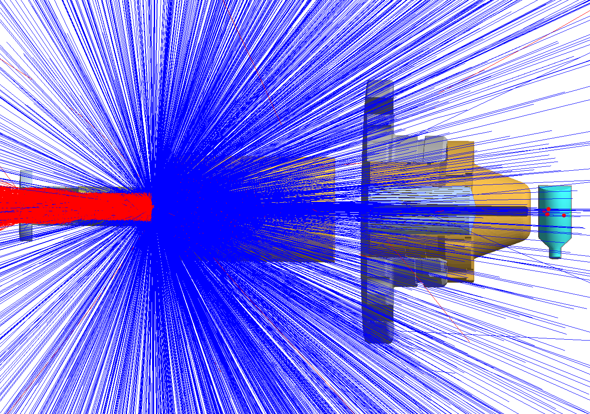

# ANL/JLAB Bubble Chamber Experiment Geant4 Simulation

* Files modified from older 2015 Geant4 bubble chamber simulations https://github.com/gemc/detectors/tree/master/injector 

* To run these simulations on your local machine you need GEMC and the JLab compute enviroment. You can find a docker container with all of the necessary programs and dependancies here https://gemc.jlab.org/gemc/html/docker.html. 

* Information about the bubble experiment can be found here https://wiki.jlab.org/ciswiki/index.php/Bubble_Chamber 

* For more info on running this simulation check the <a href="https://github.com/dneto1729/BubbleChamberSim/wiki/Bubble-Chamber-Simulation-Using-Geant4">wiki for this code.<a/> 
